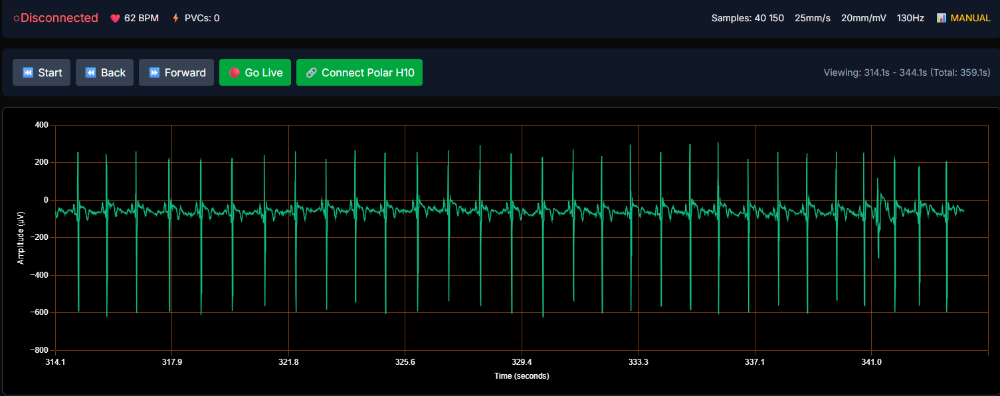
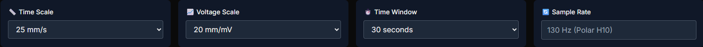
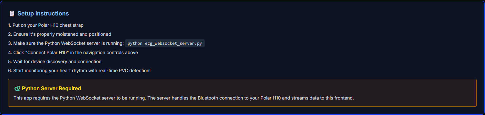

# 🫀 Advanced ECG Arrhythmia Classification Platform

> Real-time cardiovascular signal processing and machine learning-based PVC detection using Polar H10 biomedical sensors

[](https://choosealicense.com/licenses/mit/)
[](https://www.python.org/downloads/)
[](https://nextjs.org/)
[](https://www.typescriptlang.org/)
[]()
[]()

A sophisticated real-time electrocardiographic monitoring platform that leverages advanced digital signal processing, statistical analysis, and machine learning algorithms for automated detection and classification of premature ventricular contractions (PVCs) in clinical-grade ECG waveforms.

## 🎯 Project Vision & Objectives

### Current Implementation
This platform currently provides **real-time ECG acquisition, visualization, and preliminary arrhythmia detection** using R-R interval variability analysis. The system demonstrates professional-grade signal processing capabilities with medical device-inspired interface design.

### Strategic Roadmap
The ultimate goal is to develop a **comprehensive machine learning-based PVC classification system** incorporating:

- **Deep Learning Models**: Convolutional Neural Networks (CNNs) for morphological feature extraction
- **Advanced Statistical Methods**: Wavelet transforms, HRV analysis, and spectral domain features
- **Clinical-Grade Classification**: Multi-class arrhythmia detection (PVC, PAC, VT, SVT)
- **Real-time Inference**: Edge computing optimization for sub-100ms classification latency
- **Federated Learning**: Privacy-preserving distributed model training across patient populations

## 🔬 Technical Architecture & Signal Processing Pipeline

### Current System Components


*Figure 1: Real-time ECG waveform visualization with integrated arrhythmia detection and clinical-grade scaling controls*

The platform implements a sophisticated **multi-tier architecture** for biomedical signal acquisition and processing:

#### 1. **Biomedical Data Acquisition Layer**
- **Hardware**: Polar H10 chest-mounted biomedical sensor
- **Sampling Rate**: 130 Hz (7.69ms temporal resolution)
- **ADC Resolution**: 24-bit signed integer amplitude encoding
- **Signal Range**: ±3.3mV with μV precision
- **Communication Protocol**: Bluetooth Low Energy (BLE) with GATT services

#### 2. **Signal Processing Backend (Python)**
- **Real-time Streaming**: Asynchronous WebSocket server with <50ms latency
- **Data Preprocessing**: Digital filtering and artifact rejection algorithms
- **Feature Extraction**: R-peak detection using adaptive thresholding
- **Statistical Analysis**: R-R interval variability computation and outlier detection

#### 3. **Clinical Visualization Frontend (TypeScript/React)**
- **Medical-Grade Display**: Chart.js-powered ECG rendering with clinical scaling
- **Interactive Controls**: Time/voltage scale adjustment (mm/s, mm/mV standards)
- **Real-time Analytics**: Live heart rate computation and arrhythmia counting


*Figure 2: Advanced control panel featuring medical device-standard time/voltage scaling and configurable visualization parameters*

## 📊 Current Feature Set

### Real-time Signal Processing
- **Adaptive R-Peak Detection**: Morphology-based peak identification with noise immunity
- **Heart Rate Variability (HRV)**: Statistical analysis of R-R interval distributions
- **Arrhythmia Detection**: Rule-based PVC identification using temporal pattern analysis
- **Signal Quality Assessment**: Real-time SNR estimation and electrode contact monitoring

### Clinical Interface Design
- **Medical Device Standards**: ECG paper-equivalent scaling (25mm/s, 10mm/mV)
- **Navigation Controls**: Temporal scrolling through historical waveform data
- **Live Monitoring Mode**: Auto-scrolling real-time display with configurable time windows
- **Multi-scale Visualization**: Adjustable time/voltage ranges for detailed morphology analysis


*Figure 3: Comprehensive setup workflow with integrated system status monitoring and troubleshooting guidance*

## 🤖 Machine Learning Development Roadmap

### Phase 1: Data Pipeline & Feature Engineering
- **Signal Preprocessing**: Bandpass filtering (0.5-40Hz), baseline wandering removal
- **Morphological Features**: QRS complex width, amplitude ratios, template matching
- **Temporal Features**: RR-interval statistics, HRV parameters (SDNN, RMSSD, pNN50)
- **Spectral Analysis**: Power spectral density, frequency domain HRV metrics

### Phase 2: Classical ML Baseline Models
- **Support Vector Machines**: RBF kernel optimization for non-linear classification
- **Random Forest Ensembles**: Feature importance ranking and overfitting prevention
- **Gradient Boosting**: XGBoost/LightGBM with hyperparameter optimization
- **Performance Metrics**: Sensitivity, specificity, PPV, NPV with clinical validation

### Phase 3: Deep Learning Implementation
- **1D CNNs**: Raw ECG waveform classification with learnable filters
- **LSTM/GRU Networks**: Temporal sequence modeling for rhythm analysis
- **Transformer Architecture**: Attention mechanisms for long-range dependencies
- **Transfer Learning**: Pre-trained models from large ECG databases (MIT-BIH, PTB-XL)

### Phase 4: Advanced Statistical Methods
- **Wavelet Transform Analysis**: Multi-resolution time-frequency decomposition
- **Independent Component Analysis**: Artifact separation and signal enhancement
- **Empirical Mode Decomposition**: Non-linear signal component extraction
- **Bayesian Classification**: Uncertainty quantification and confidence intervals

## 🏥 Clinical Applications & Validation

### Target Use Cases
- **Continuous Cardiac Monitoring**: ICU and telemetry ward applications
- **Sports Cardiology**: Athletic performance and arrhythmia screening
- **Telemedicine**: Remote patient monitoring with automated alerting
- **Research Applications**: Clinical trials and epidemiological studies
- **Educational Tools**: Medical student training and ECG interpretation learning

### Validation Framework
- **Clinical Dataset Integration**: MIT-BIH Arrhythmia Database, AHA Database
- **Cross-validation Protocols**: Patient-independent evaluation strategies
- **Regulatory Compliance**: FDA 510(k) pathway considerations for medical devices
- **Performance Benchmarking**: Comparison with commercial Holter monitors

## 🛠️ Technical Implementation Stack

### Backend Infrastructure
```python
# Core Technologies
- Python 3.8+ (Asyncio concurrency)
- WebSocket Protocol (RFC 6455 compliance)
- Bleak BLE Stack (Cross-platform Bluetooth)
- NumPy/SciPy (Scientific computing)
- Scikit-learn (ML pipeline)
- PyTorch/TensorFlow (Deep learning)
```

### Frontend Architecture
```typescript
// Modern Web Technologies
- Next.js 15 (React framework with SSR)
- TypeScript (Static type checking)
- Chart.js (Hardware-accelerated rendering)
- Tailwind CSS (Utility-first styling)
- WebSocket Client (Real-time communication)
- Web Workers (Background processing)
```

### Data Processing Pipeline
```
Polar H10 → BLE → Python Server → WebSocket → React Client
   130Hz      ↓       ↓             ↓           ↓
 Raw ECG → Filtering → R-peak → Feature → Visualization
          Detection  Extraction  Classification
```

## 📈 Performance Specifications

| Metric | Current Performance | Target (ML Enhanced) |
|--------|-------------------|---------------------|
| **Sampling Rate** | 130 Hz | 130 Hz (maintained) |
| **Detection Latency** | <100ms | <50ms |
| **R-peak Accuracy** | >95% | >99% |
| **PVC Sensitivity** | 85% (rule-based) | >95% (ML-based) |
| **False Positive Rate** | 5-10% | <2% |
| **Processing Throughput** | Real-time | Real-time + batch |

## 🔬 Research & Development Priorities

### Immediate Development (Q2 2025)
1. **Enhanced Signal Processing**: Advanced filtering and noise reduction algorithms
2. **Feature Engineering**: Comprehensive morphological and temporal feature extraction
3. **Dataset Collection**: Integration with public ECG databases and annotation tools
4. **Model Development**: Implementation of baseline ML classification algorithms

### Medium-term Goals (Q3-Q4 2025)
1. **Deep Learning Pipeline**: CNN/LSTM hybrid architectures for ECG classification
2. **Real-time Inference**: Model optimization and edge deployment strategies
3. **Clinical Validation**: Performance evaluation on diverse patient populations
4. **Regulatory Preparation**: Documentation for medical device approval processes

### Long-term Vision (2026+)
1. **Multi-lead ECG Support**: 12-lead clinical ECG integration capabilities
2. **Federated Learning**: Privacy-preserving distributed model training
3. **Clinical Decision Support**: Integration with electronic health records (EHR)
4. **Commercial Deployment**: SaaS platform for healthcare institutions

## 🚀 Getting Started

### Prerequisites
- **Hardware**: Polar H10 chest strap sensor
- **Software**: Python 3.8+, Node.js 18+, Bluetooth 4.0+ adapter
- **OS Compatibility**: Windows 10+, macOS 10.15+, Ubuntu 18.04+

### Quick Installation
```bash
# Clone repository
git clone https://github.com/mirkovicdev/Polar-H10-ECG-Arrythmia-classifier.git
cd Polar-H10-ECG-Arrythmia-classifier

# Setup Python environment
python -m venv venv
source venv/bin/activate  # Windows: venv\Scripts\activate
pip install asyncio websockets numpy bleak scikit-learn

# Setup Node.js dependencies
npm install

# Launch system
python ecg_websocket_server.py  # Terminal 1
npm run dev                     # Terminal 2
```

### System Validation
1. Navigate to `http://localhost:3000`
2. Follow setup instructions for Polar H10 pairing
3. Verify real-time ECG waveform display
4. Test arrhythmia detection with controlled breathing patterns

## 📊 Data Science & Analytics

### Feature Engineering Pipeline
The platform implements a comprehensive feature extraction framework for ECG signal characterization:

- **Morphological Features**: QRS duration, T-wave amplitude, ST-segment analysis
- **Temporal Features**: RR-intervals, heart rate variability metrics
- **Frequency Domain**: Power spectral density, spectral entropy
- **Nonlinear Dynamics**: Approximate entropy, sample entropy, fractal dimensions

### Model Development Strategy
```python
# Example ML Pipeline Structure
ECGClassifier = Pipeline([
    ('preprocessor', ECGSignalProcessor()),
    ('feature_extractor', MorphologicalFeatures()),
    ('scaler', StandardScaler()),
    ('classifier', RandomForestClassifier(n_estimators=100))
])
```

## 🔒 Medical & Regulatory Compliance

**⚠️ IMPORTANT MEDICAL DISCLAIMER**: This platform is currently designed for **research and educational purposes only**. It is not approved as a medical device and should not be used for clinical diagnosis or treatment decisions. All cardiac rhythm abnormalities require evaluation by qualified healthcare professionals.

### Regulatory Pathway
- **FDA Class II Medical Device**: Planned 510(k) submission pathway
- **CE Marking**: European medical device regulation compliance
- **ISO 13485**: Quality management system for medical devices
- **IEC 60601**: Medical electrical equipment safety standards

## 🤝 Contributing to Cardiovascular Technology

We welcome contributions from the biomedical engineering, machine learning, and clinical communities:

### Development Areas
- **Signal Processing**: Advanced filtering and artifact rejection algorithms
- **Machine Learning**: Novel architectures for ECG classification
- **Clinical Validation**: Performance evaluation on diverse patient populations
- **User Interface**: Medical device usability and accessibility improvements

### Research Collaboration
- **Academic Partnerships**: University research collaborations welcome
- **Clinical Studies**: IRB-approved validation studies with healthcare institutions
- **Open Science**: Commitment to reproducible research and open-source development

## 📚 Scientific References & Validation

This platform builds upon established research in cardiovascular signal processing and machine learning:

- **ECG Analysis**: Pan-Tompkins algorithm, Hamilton-Tompkins method
- **Arrhythmia Classification**: MIT-BIH benchmark studies, AHA guidelines
- **Machine Learning**: State-of-the-art CNN architectures for biomedical signals
- **Clinical Validation**: Sensitivity/specificity benchmarks from peer-reviewed literature

## 📄 License & Legal

This project is licensed under the MIT License, promoting open-source collaboration while maintaining intellectual property protections for derivative commercial applications.

---

**Advancing Cardiovascular Care Through Intelligent Signal Processing**

*Developed with ❤️ for the global biomedical research community*

[]()
[]()
[]()
